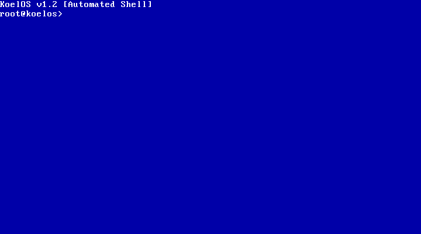
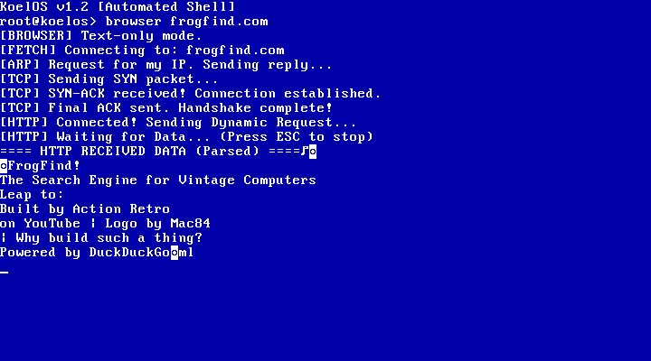

# KoelOS

> A hand-built 64-bit hobby OS written in NASM that boots straight into a shell, brings up networking, and ships with a text-only browser and a serial console.



KoelOS is a solo-built operating system project focused on direct control over the full stack:

- BIOS boot sector
- long mode switch
- VGA text shell
- keyboard input
- Intel E1000 networking
- DHCP, DNS, ping, packet listening
- HTTP fetch + a text browser inspired by sites like `frogfind.com`

## Screenshots

| Boot | Text Browser |
| --- | --- |
|  |  |

## Highlights

- Pure NASM codebase
- Custom BIOS bootloader that enters 64-bit long mode
- Shell-first UX with one command per file in `apps/`
- Small network stack with ARP, IPv4, ICMP, UDP, DNS, TCP, and HTTP pieces
- `browser <domain>` command that renders text-only pages in the terminal
- Metal and VirtualBox build targets with separate output directories
- Linux-tested VirtualBox support with a portable `.vdi` launcher script

## Commands

The authoritative list is whatever lives in `apps/*.asm`; `help` prints it with a
short description for each command. Current set:

- System: `help`, `ver`, `clear`, `echo`, `mem`, `date`, `uptime`, `reboot`, `shutdown`
- Files: `ls`, `cat`, `hex`, `edit`, `mkfile`, `cp`, `mv`, `rm`, `binwrite`, `format`
- Network: `netinit`, `ifconfig`, `ip`, `dhcp`, `dns`, `ping`, `listen`, `announce`, `diag`, `fetch`, `browser`
- Language: `alkan` (REPL or run a program)

Good demo commands:

```text
browser frogfind.com
browser example.com
dns example.com
ping
ifconfig
```

## Project Layout

```text
.
├── apps/           # shell commands, one command per file
├── drivers/        # low-level runtime, VGA, NIC, TCP/IP, HTTP helpers
├── build/          # generated manifests and build logs
├── dist/
│   ├── metal/      # raw BIOS disk image and binaries
│   └── vbox/       # VirtualBox disk image
├── docs/
├── boot.asm        # 64-bit HDD boot sector (LBA, long mode)
├── boot_floppy.asm # 64-bit floppy boot sector (CHS, long mode)
├── boot_metal32.asm / boot_floppy32.asm  # 32-bit boot sectors (protected mode)
├── kernel.asm      # 64-bit kernel: shell entry point and global state
├── kernel32.asm    # 32-bit "lite" kernel (for non-64-bit CPUs)
└── build.sh        # the build tool (32/64, floppy/metal, run/test/write/vdi)
```

## Quick Start

Everything goes through one script: [build.sh](build.sh).

```bash
./build.sh                       # no arguments -> interactive menu (a GUI on macOS)
./build.sh --run                 # build the default (64-bit floppy), boot in QEMU
./build.sh --target metal --run  # the full 64-bit OS from a hard-disk image
```

Run it with **no arguments** and it pops up a menu (a native dialog on macOS, a
text menu elsewhere) to pick arch, target, and action. Pass any flag to skip the
menu and go straight to building.

### The build matrix

| `--arch` | `--target` | Image | Notes |
| --- | --- | --- | --- |
| `64` (default) | `floppy` (default) | `dist/floppy/koelOS-floppy.img` | full OS, needs a 64-bit CPU |
| `64` | `metal` | `dist/metal/koelOS-metal.img` | full OS, needs a 64-bit CPU |
| `32` | `floppy` | `dist/floppy32/koelOS32-floppy.img` | lite shell, any 386+ |
| `32` | `metal` | `dist/metal32/koelOS32-metal.img` | lite shell, any 386+ |

### Flags

```bash
./build.sh --arch 32 --target floppy        # 32-bit image for a pre-2004 board
./build.sh --run                            # boot the result in QEMU
./build.sh --test                           # headless boot smoke test (used by CI)
./build.sh --target metal --vdi             # also emit a VirtualBox .vdi
./build.sh --target floppy --write          # build, then dd to a real floppy (see below)
```

`--run` / `--test` pick the QEMU CPU automatically: a 64-bit CPU for `--arch 64`,
an emulated 32-bit CPU for `--arch 32` (so the lite kernel is exercised the way
real old hardware would). Override with `--cpu MODEL`.

### Boot from a floppy

KoelOS boots off a real 1.44 MB floppy (or USB-FDD). The floppy bootloaders load
the kernel with classic **CHS reads** (INT 13h AH=02h) instead of the LBA/EDD
read used by the hard-disk boot, and carry a FAT-style BPB header for BIOS
compatibility.

```bash
./build.sh --target floppy --write          # auto-detects a 1.44 MB disk, confirms, writes
./build.sh --target floppy --write /dev/disk2   # or name the device explicitly
```

`--write` unmounts the disk, `dd`s the image (with `sudo`), and ejects. To flash
by hand instead:

```bash
sudo dd if=dist/floppy/koelOS-floppy.img of=/dev/diskN bs=512
```

Note: a floppy-only machine has no IDE/ATA disk, so the storage commands
(`ls`, `cat`, `cp`, `mv`, saving in `edit`, …) report `[FS] Storage I/O error`.
Everything else — shell, history, in-RAM `edit`, networking, `alkan`,
`date`/`uptime`, `clear`/`echo`/`mem`, `reboot`/`shutdown` — works.

### 32-bit build (for pre-2004 / non-64-bit CPUs)

The main KoelOS kernel is 64-bit and needs a long-mode CPU. For older boards
(Pentium 4, Athlon XP, etc. — anything 386+ without 64-bit), there's a separate
**32-bit kernel** ([kernel32.asm](kernel32.asm)) that boots in 32-bit protected
mode. It carries the full KoelOS feature set **except networking**: VGA/serial
console, PS/2 keyboard, CMOS clock, the KFS1 filesystem ([fs32.asm](fs32.asm):
`ls`/`cat`/`mkfile`/`rm`/`cp`/`mv`/`hex`/`binwrite`/`format` + the `edit` line
editor), and the full Alkan language ([alkan32.asm](alkan32.asm)), plus
`help`/`ver`/`clear`/`echo`/`date`/`uptime`/`reboot`/`shutdown`/`colors`.

The networking stack stays 64-bit only — it is hardcoded for the VirtualBox/QEMU
Intel 82540EM NIC, so it would not run on a real pre-2004 board's NIC anyway.
The filesystem needs an IDE/ATA disk; on a floppy-only machine the storage
commands report `[FS] Storage I/O error`.

```bash
./build.sh --arch 32 --target floppy --write   # build the 32-bit floppy and burn it
```

`koel` builds, runs, and smoke-tests every arch × target combination. `run`/`test`
default to a 32-bit QEMU CPU for `--arch 32` (so it's actually exercised the way
real hardware would), and a 64-bit CPU for `--arch 64`.

### VirtualBox

```bash
./build.sh --arch 64 --target metal --vdi   # -> dist/metal/KoelOS.vdi
```

Create a VM with an Intel `82540EM` NIC on `NAT` and MAC `52:54:00:12:34:56`
(the kernel hardcodes that MAC), and attach the `.vdi`.

## Real Hardware

KoelOS now builds into a BIOS-bootable raw disk image for USB/HDD boot on a real machine.

See `docs/metal-boot.md` for:

- flashing instructions
- expected firmware settings
- current bare-metal limitations

Short version:

```bash
diskutil unmountDisk /dev/diskN
sudo dd if=dist/metal/koelOS-metal.img of=/dev/rdiskN bs=1m
diskutil eject /dev/diskN
```

## Current Hardware Reality

The OS boots on a BIOS-style PC image now, but networking is still tuned for the Intel `82540EM` NIC used by VirtualBox.

That means:

- shell boot on real hardware is the target
- networking on real hardware is not universal yet
- VirtualBox `NAT` (or QEMU user networking) is currently the best-supported environment for the browser and network stack

## Why It Exists

KoelOS is not trying to be a clone of a modern desktop OS.

It is a direct, personal OS project built to explore the whole path from boot sector to browser output with as little abstraction as possible.

## Status

Working right now:

- boots to shell
- runs in VirtualBox
- launches from a copied `.vdi` on Linux through the portable launcher
- builds a raw metal image
- resolves DNS
- performs HTTP GET requests
- renders text-only pages through `browser`

In progress / future work:

- broader bare-metal NIC support
- cleaner HTML-to-text rendering
- richer browser navigation
- UEFI boot support
